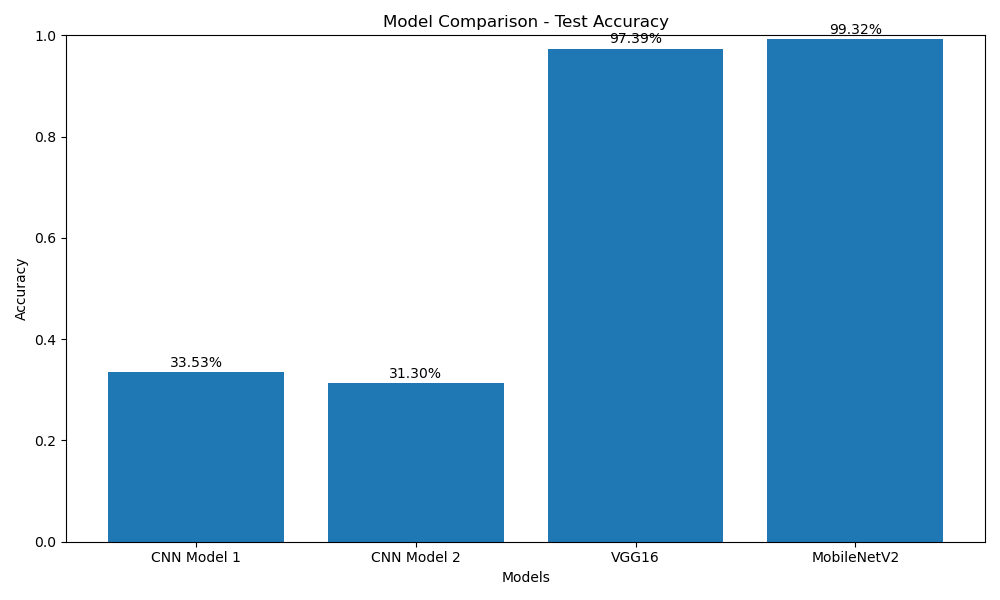

# Image Classification of Natural Images using CNNs and Transfer Learning

This project demonstrates a complete machine learning workflow for image classification. It uses the "natural_images" dataset, which contains 8 distinct categories. The project covers everything from data analysis and preprocessing to building, training, and evaluating multiple Convolutional Neural Network (CNN) models, including custom architectures and transfer learning models (VGG16, MobileNetV2). Finally, it establishes an inference pipeline to predict the class of a new image using the best-performing model.



## Table of Contents

- [Project Overview](#project-overview)
- [Features](#features)
- [Dataset](#dataset)
- [Usage](#usage)
  - [Part 1: Training the Models](#part-1-training-the-models)
  - [Part 2: Running the GUI Application](#part-2-running-the-gui-application)
- [Graphical User Interface (GUI)](#graphical-user-interface-gui)
- [Code Explanation](#code-explanation)
  - [1. Data Analysis](#1-data-analysis)
  - [2. Preprocessing](#2-preprocessing)
  - [3. Data Splitting and Augmentation](#3-data-splitting-and-augmentation)
  - [4. Modeling](#4-modeling)
  - [5. Training](#5-training)
  - [6. Evaluation](#6-evaluation)
  - [7. Inference Pipeline](#7-inference-pipeline)
- [Results](#results)

## Project Overview

The primary goal of this project is to classify images into one of eight categories. To achieve this, we explore and compare four different deep learning models:
1.  A simple, custom-built CNN.
2.  A deeper, more complex custom-built CNN.
3.  A transfer learning model using the **VGG16** architecture.
4.  A transfer learning model using the **MobileNetV2** architecture.

The project evaluates these models based on their test accuracy and other metrics, selects the best one, and creates a ready-to-use function for making predictions on new images.

## Features

- **End-to-End Workflow:** From data loading to final prediction.
- **Data Analysis:** Comprehensive analysis of class distribution and image properties.
- **Image Preprocessing:** Resizing, normalization, and shuffling.
- **Data Augmentation:** Increases dataset diversity and reduces overfitting using `ImageDataGenerator`.
- **Multiple Model Architectures:** Compares custom CNNs with powerful pre-trained models.
- **Transfer Learning:** Leverages VGG16 and MobileNetV2 for robust feature extraction.
- **Callbacks:** Uses `EarlyStopping` to prevent overfitting and `ModelCheckpoint` to save the best model weights.
- **Detailed Evaluation:** Generates accuracy scores, classification reports, and confusion matrices.
- **Visualizations:** Plots training history, model comparisons, and prediction examples.
- **Inference Pipeline:** A simple function to classify a single image.

## Dataset

The project uses the **natural_images** dataset, which must be structured with separate folders for each category.

- **Categories:** `airplane`, `car`, `cat`, `dog`, `flower`, `fruit`, `motorbike`, `person`.
- **Image Size:** All images are resized to `150x150` pixels.

Which can be obtained from here : https://www.kaggle.com/datasets/prasunroy/natural-images 

## Usage

The project is divided into two main parts: training the models and running the GUI.

### Part 1: Training the Models

First, you need to run the main training script to generate the trained model files (`.h5`).

1.  **Update Data Directory**: In the main training script, update the `DATADIR` variable to point to the root directory of your "natural_images" dataset:
    ```python
    DATADIR = r'C:/path/to/your/natural_images'
    ```

2.  **Run the Training Script**:
    ```bash
    python training_script.py
    ```
    This will train all four models and save their weights (e.g., `VGG16_Model.h5`) in the project directory. Note which model performed the best.

### Part 2: Running the GUI Application

Once you have a trained model, you can use the GUI to make predictions.

1.  **Update Model Path**: In the GUI script, update the `MODEL_PATH` variable to point to the `.h5` file of your best-performing model:
    ```python
    MODEL_PATH = r"path/to/your/best_model.h5" # e.g., "MobileNet_Model.h5"
    ```

2.  **Run the GUI Script**:
    ```bash
    python gui_script.py
    ```
    The application window will open. Click "Upload Image" to classify a new image.

## Graphical User Interface (GUI)

To provide an easy-to-use interface for classifying new images, this project includes a graphical application built with **Tkinter**.

### Features of the GUI

-   **Upload Image**: A simple "Upload Image" button opens a file dialog to select an image from your computer (`.jpg`, `.png`, etc.).
-   **Display Image**: The selected image is preprocessed and displayed within the application window.
-   **Show Prediction**: The model's prediction (the image category) and its confidence score are clearly displayed below the image.

The GUI script loads the pre-trained model and defines the `predict_image()` function, which handles file selection, image preprocessing, prediction, and updating the UI elements.


## Code Explanation

### 1. Data Analysis

The `analyze_dataset()` function performs an initial exploratory data analysis (EDA). It:
- Counts the number of images in each category.
- Plots a bar chart of the class distribution.
- Displays one sample image from each category.
- Analyzes the dimensions of a sample of images.

### 2. Preprocessing

The `create_training_data()` function handles the data preparation. For each image, it:
1.  Reads the image file.
2.  Converts the color space from BGR (OpenCV's default) to RGB.
3.  Resizes the image to `150x150` pixels.
4.  Normalizes pixel values to the `[0, 1]` range by dividing by 255.0.
5.  Appends the processed image array and its corresponding integer label to a list.

Finally, the entire dataset is shuffled to ensure randomness. The processed data (`X`) and labels (`y`) are saved using `pickle` for quick reloading in the future.

### 3. Data Splitting and Augmentation

- **Splitting**: The data is split into training (70%), validation (15%), and test (15%) sets using `sklearn.model_selection.train_test_split`.
- **Augmentation**: `keras.preprocessing.image.ImageDataGenerator` is used to create augmented images for the training set on-the-fly. This helps the model generalize better by exposing it to a wider variety of image variations. The augmentations include:
  - `rotation_range=15`
  - `width_shift_range=0.1`
  - `height_shift_range=0.1`
  - `shear_range=0.1`
  - `zoom_range=0.1`
  - `horizontal_flip=True`

### 4. Modeling

Four different models are defined:
- `create_cnn_model1()`: A simple CNN with three convolutional blocks, each containing `Conv2D`, `BatchNormalization`, `MaxPooling2D`, and `Dropout`.
- `create_cnn_model2()`: A deeper CNN with four convolutional blocks and more filters, designed to capture more complex features.
- `create_vgg16_model()`: A transfer learning model using the pre-trained VGG16 architecture. The convolutional base is frozen, and new, trainable fully-connected layers are added on top.
- `create_mobilenet_model()`: A lightweight transfer learning model using MobileNetV2. It uses `GlobalAveragePooling2D` which drastically reduces the number of parameters compared to `Flatten`.

### 5. Training

The `train_and_plot_history()` function orchestrates the training process for a given model.
- **Callbacks**:
  - `EarlyStopping`: Monitors `val_loss` and stops training if it doesn't improve for 2 consecutive epochs (`patience=2`), restoring the best weights found.
  - `ModelCheckpoint`: Saves the best version of the model (`.h5` file) based on `val_accuracy`.
- **Training**: The `model.fit()` method is called using the data generator for the training data.
- **Visualization**: After training, it plots and saves the training & validation accuracy and loss curves.

### 6. Evaluation

The `evaluate_model()` function provides a comprehensive assessment of a trained model. It:
1.  Calculates the final test accuracy and loss.
2.  Generates a **classification report** with precision, recall, and F1-score for each class.
3.  Creates and displays a **confusion matrix** to visualize class-wise performance.
4.  Visualizes 15 sample predictions from the test set, coloring the titles green for correct predictions and red for incorrect ones.

### 7. Inference Pipeline

- **Best Model Selection**: The script identifies the best model by comparing the test accuracies of all four models.
- **Inference Function**: The `create_inference_pipeline()` function creates and returns a simple prediction function, `predict_image(image_path)`. This function can take the path to any image, preprocess it correctly, and return the predicted class and confidence score.

## Results

After running the script, the following artifacts will be generated:
- **Pickle Files**: `X.pickle`, `y.pickle` containing the preprocessed dataset.
- **Model Files**: `CNN_Model1.h5`, `CNN_Model2.h5`, `VGG16_Model.h5`, `MobileNet_Model.h5`.
- **Training Plots**: `CNN_Model1_history.png`, etc., for each model.
- **Evaluation Plots**: `CNN_Model1_confusion_matrix.png`, `CNN_Model1_sample_predictions.png`, etc.
- **Comparison Plot**: `model_comparison.png` showing a bar chart of the final test accuracies.

The console output will announce the best-performing model based on test accuracy. The inference pipeline will then be set up using this model, ready for new predictions.
